## Create your first API

To manage your API, first, you need to create it :)
To achieve this, we are going to use [ASP.NET Web API](https://www.asp.net/web-api), one of the most famous frameworks to build HTTP services and RESTful applications of the .NET Framework.

In this exercise, we are going to build a simple **.NET Conf API** from scratch that will display the information of all the .NET Conferences in the world, the talks and speakers. Then, we are going to configure the API to expose its contract and documentation using [Swagger](https://swagger.io/). And finally, we are going to deploy the API to Azure.

> **Note:** If you need more information about ASP.NET Web API, see [this tutorial](https://docs.microsoft.com/en-us/aspnet/web-api/overview/getting-started-with-aspnet-web-api/tutorial-your-first-web-api).

### Exercise sections

This exercise contains the sections described below. You can use the working example with everything set up under the **end** folder to skip the first two sections, but you'll need to deploy the app in Azure as described in the section 3.

1. [Create an API with ASP.NET Web API](#create-an-api-with-aspnet-web-api)
1. [Configure your API to expose Swagger documentation](#configure-your-api-to-expose-swagger-documentation)
1. [Deploy your API to Azure](#deploy-your-api-to-azure)

### Swagger overview

[Swagger](https://swagger.io/) is an open source framework that helps developers design, build, document, and consume RESTful Web services. A Swagger file (`YAML` or `json`) allows you to describe the specification of your entire API, including:

* Available endpoints and operations (GET /users, POST /users, etc.).
* Operation parameters, input and output for each operation, available return types, etc.
* Authentication methods supported by your API.
* Documentation of your API: descriptions, license, terms of use, contact information, etc.

On January 2016, SmartBear Software donated the Swagger Specification directly to the [Open API Initiative](https://github.com/OAI/OpenAPI-Specification/blob/master/README.md)(OAI), with the goal of creating, evolving and promoting a vendor neutral description format. It's current version [3.0.0](https://github.com/OAI/OpenAPI-Specification/blob/master/versions/3.0.0.md), also includes other API Specifications, like [RAML](https://blogs.mulesoft.com/dev/api-dev/open-api-raml-better-together/).

For this exercise, we are going to use Swagger 2.0, which is described (and also known as) in the [Open API Specification v2.0](https://github.com/OAI/OpenAPI-Specification/blob/master/versions/2.0.md).

### Create an API with ASP.NET Web API

In this section, you will create an API from scratch that will display the information of all the .NET Conferences in the world, the talks and speakers. We will user the *ASP.NET Web API* template to scaffold the structure needed in our application.

> **Note:** if this is the first time with ASP.NET Web API, you can follow [this step-by-step guide](https://docs.microsoft.com/en-us/aspnet/core/tutorials/first-web-api) to understand the basics of this framework.

#### Creating the project

1. Open Visual Studio. In the **File** menu, select **New** and then **Project**.
1. Select the **ASP.NET Core Web Application (.NET Core)** project template. Name the project `NETConfAPI` and then click **OK**.

    

1. In the **New ASP.NET Core Web Application** dialog, select the **Web API template** and then click **OK**. _Do not select the option Enable Docker support_.

    

1. Now, let's test the app. Run the app in Debug mode by pressing `CTRL + F5`. Visual Studio will launch a new window or tab of your default browser pointing to `http://localhost:5000/api/values` (the port will be randomly chosen).

    For instance, this is you will see in Chrome:

    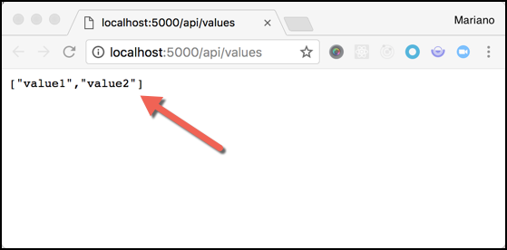

    Notice that this is exactly what is coded in the **ValuesController.cs** file (inside the **Controllers** folder). Take a look at the `Get()` method:

    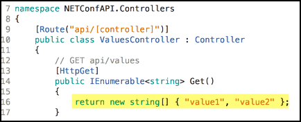

    ASP.NET WebAPI uses _Controllers_ for handling HTTP requests and HTTP responses. If this is your first API, play with it for a couple of minutes, for instance, by calling http://localhost:5000/api/values/5.

#### Configuring the model

A model is an object that represents the data in your application. They are usually implemented by creating really simple C# classes also know as Plain Old C# Object (POCOs). We are going to create a few models that will store the information needed for our conference API, in detail:

* A *Speaker* class to store the information of each speaker.
* A *Talk* class to store the title of the talk and its speaker.
* A *Conference* class to store information about conferences and their talks.

Now that we know the basics, let's get our hands dirty:

1. Add a new folder named **Models** by right-clicking the project in the Solution Explorer and then selecting **Add** and then **New Folder**.

    > **Note:** A model is an object that represents the data in your application. They are usually implemented by creating really simple C# classes also know as Plain Old C# Object (POCOs).

1. Add a **Speakers** class. Right-click the **Models** folder, select **Add** and then **Class**. Replace the generated code with the following:

    ```cs
    namespace NETConfAPI.Models
    {
        public class Speaker
        {
            public int Id { get; set; }
            public string Name { get; set; }
        }
    }
    ```

1. Repeat the same steps to create a **Talk** class.

    ```cs
    using System.ComponentModel.DataAnnotations.Schema;

    namespace NETConfAPI.Models
    {
        public class Talk
        {
            public int Id { get; set; }
            public string Title { get; set; }

            public virtual Speaker Speaker { get; set; }
        }
    }
    ```

1. And now for the **Conference** class.

    ```cs
    using System.Collections.Generic;

    namespace NETConfAPI.Models
    {
        public class Conference
        {
            public int Id { get; set; }
            public string Name { get; set; }
            public string Year { get; set; }

            public virtual ICollection<Talk> Talks { get; set; }
        }
    }
    ```

We now need to define where the data is going to be stored. For simplicity, we will use an in-memory database that will be filled with data every time the API starts (and restarts). To configure this, let's go to the next step.

#### Creating the database context

The database context (or `DbContext`) is the main class that coordinates the communication between your application and your database or storage. We will use Entity Framework, a well-known and widely use framework for this job, that provides a *Code First* convention to generate the database model (tables, columns, etc) with the code we write in C# (for more information, see [here](https://msdn.microsoft.com/en-us/library/jj679962(v=vs.113).aspx)).

1. Add a **NETConfContext** class by right-clicking the **Models** folder, selecting **Add** and then **Class**.
Replace the generated code with the following:

    ```cs
    using System;
    using Microsoft.EntityFrameworkCore;

    namespace NETConfAPI.Models
    {
        public class NETConfContext : DbContext
        {
            public NETConfContext(DbContextOptions<NETConfContext> options)
                : base(options)
            {

            }

            public DbSet<Conference> Conferences { get; set; }
            public DbSet<Speaker> Speakers { get; set; }
            public DbSet<Talk> Talks { get; set; }
        }
    }
    ```

1. Now it's time to register the database context. We will configure it to inject it into the controllers, by taking advantage of the dependency injection container provided by the framework. We are going to configure an in-memory database that will in the service container that will be sent to the controller's constructor.
For this, replace the contents of the **Startup.cs** file with the following:

    * Add these `using` statements at the top of the file:

    ```cs
    using Microsoft.EntityFrameworkCore;
    using NETConfAPI.Models;
    ```

    ** Update the `ConfigureServices()` method with:

    ```cs
    // This method gets called by the runtime. Use this method to add services to the container.
    public void ConfigureServices(IServiceCollection services)
    {
        services.AddDbContext<NETConfContext>(opt => opt.UseInMemoryDatabase("NETConf"));
        services.AddMvc();
    }
    ```

    >**Note:** For more information about Dependency Injection, see [here](https://docs.microsoft.com/en-us/aspnet/web-api/overview/advanced/dependency-injection#what-is-dependency-injection).

1. Finally, we will use a _very simple_ approach to seed the database. Create a new **Utils.cs** file inside the **Models** folder and replace the generated code with the following:

    ```cs
    using System;
    using System.Collections.Generic;

    namespace NETConfAPI.Models
    {
        public static class Utils
        {
            public static void InitContext(NETConfContext context)
            {
                var speaker1 = new Speaker() { Id = 1, Name = "Carlos Dieguez" };
                var speaker2 = new Speaker() { Id = 2, Name = "Mariano Vazquez" };
                var speaker3 = new Speaker() { Id = 3, Name = "Sebastián Pérez" };

                var talk1 = new Talk() { Id = 1, Title = ".NET Standard: One Library to Rule Them All", Speaker = speaker1 };
                var talk2 = new Talk() { Id = 2, Title = "APIfiquemos el mundo con Azure API Management", Speaker = speaker2 };
                var talk3 = new Talk() { Id = 3, Title = "Mis primeros pasos en Xamarin", Speaker = speaker3 };

                var conference = new Conference()
                {
                    Id = 1,
                    Year = "2017",
                    Name = "NETConfUY",
                    Talks = new List<Talk>() { talk1, talk2, talk3 }
                };

                context.Conferences.Add(conference);
                context.SaveChanges();
            }
        }
    }
    ```

And now that we have configured everything we need, let's create the controllers.

#### Creating the controllers

We will now create the following three controllers in our REST API, one for each entity we have: **Speakers**, **Talks** and **Conferences**. These controllers will have the following structure:

| API                      | Description         | Request body      | Response bpdy      |
| ------------------------ | ------------------- | ----------------- | ------------------ |
| GET /api/<entity>        | Get all entities    | N/A               | Array of entities  |
| GET /api/<entity>        | Get an entity by ID | N/A               | The entity         |
| POST /api/<entity>       | Add a new entity    | New entity        | The new entity     |
| PUT /api/<entity>/{id}   | Update an entity    | Updated entity    | The updated entity |
| DELETE /api/<entity>{id} | Delete an entity    | N/A               | N/A                |

1. In Solution Explorer, right-click the **Controllers** folder, select **Add** and then **New Item**.

1. In the **Add New Item** dialog, select the **Web API Controller Class** template. Name the class **ConferencesController**.

    .

1. Replace the generated code with the following:

    ```cs
    using System.Collections.Generic;
    using System.Linq;
    using Microsoft.AspNetCore.Mvc;
    using Microsoft.EntityFrameworkCore;
    using NETConfAPI.Models;

    namespace NETConfAPI.Controllers
    {
        [Route("api/[controller]")]
        public class ConferencesController : Controller
        {
            private readonly NETConfContext context;

            public ConferencesController(NETConfContext context)
            {
                this.context = context;

                if (this.context.Conferences.Count() == 0)
                {
                    Utils.InitContext(context);
                }
            }
        }
    }
    ```

    This code does the following:

    * Defines an empty controller class with a `NETConfContext` injected into it constructor and stored in the `context` private field (in the next steps, we'll add methods to implement the API).
    * Defines that this new controller will manage calls under `api/conferences` (this is declared by the `[Route("api/[controller]")]` line).
    * Checks if the Conferences collection is empty. If it is, it initializes the context with simple data. This is a simple technique that guarantees that we'll always have data to retrieve, because a new Controller instance is created every time we we make a request to the API.

1. Now, let's add the method that will be executed when a **GET** request is made to `api/conferences`. Paste the following code below the constructor:

    ```cs
    // GET api/controllers
    [HttpGet]
    public IEnumerable<Conference> Get()
    {
        var items = this.context.Conferences
                        .Include(c => c.Talks)
                        .ThenInclude(d => d.Speaker);

        return items.ToList();
    }
    ```
1. Repeat the same idea to manage **GET** calls to `api/conferences/{id}` by pasting the following code below.

    ```cs
    // GET api/conferences/5
    [HttpGet("{id}", Name = "GetConferencesById")]
    public IActionResult GetById(int id)
    {
        var item = this.context.Conferences
                        .Include(c => c.Talks)
                        .ThenInclude(d => d.Speaker)
                        .FirstOrDefault(t => t.Id == id);

        if (item == null)
        {
            return NotFound();
        }

        return new ObjectResult(item);
    }
    ```

1. To handle **POST** calls to `api/conferences`, paste the following code below:

    ```css
    // POST api/conferences
    [HttpPost]
    public IActionResult Post([FromBody]Conference item)
    {
        if (item == null)
        {
            return BadRequest();
        }

        this.context.Conferences.Add(item);
        this.context.SaveChanges();

        return CreatedAtRoute("GetConferencesById", new { id = item.Id }, item);
    }
    ```

1. We are almost there! Now, it's time of the **PUT** operation to `api/conferences/{id}`. Paste this code below the previous one:

    ```css
    // PUT api/conferences/5
    [HttpPut("{id}")]
    public IActionResult Put(int id, [FromBody]Conference updatedItem)
    {
        if (updatedItem == null || updatedItem.Id != id)
        {
            return BadRequest();
        }

        var item = this.context.Conferences.FirstOrDefault(t => t.Id == id);
        if (item == null)
        {
            return NotFound();
        }

        item.Name = updatedItem.Name;
        item.Year = updatedItem.Year;

        this.context.Conferences.Update(item);
        this.context.SaveChanges();
        return new NoContentResult();
    }
    ```

1. Finally, let's paste this code to handle **DELETE** operations:

    ```cs
    // DELETE api/conferences/5
    [HttpDelete("{id}")]
    public IActionResult Delete(int id)
    {
        var item = this.context.Conferences
                        .Include(c => c.Talks)
                        .FirstOrDefault(t => t.Id == id);

        if (item == null)
        {
            return NotFound();
        }

        // Remove talks
        foreach (var talk in item.Talks)
        {
            this.context.Talks.Remove(talk);
        }

        this.context.Conferences.Remove(item);
        this.context.SaveChanges();
        return new NoContentResult();
    }
    ```

1. And we are done! Run the application again and navigate to `http://localhost:5000/api/conferences` to validate that everything is working. If it is, you should see this in your browser:

    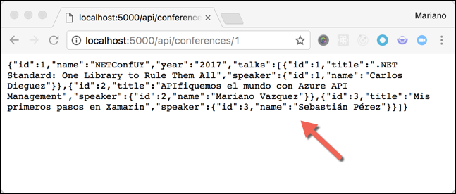

To simplify things, we've prepared two files in the **asset** folder of this exercise that you can use to generate the **SpeakersController** and **TalksController**. Once you copy these files in your app, run the app again and validate that you can receive information when calling:

* `http://localhost:5000/api/talks`
* `http://localhost:5000/api/talks/3`
* `http://localhost:5000/api/speakers`
* `http://localhost:5000/api/speakers/2`

If everything works, you are now ready to proceed to the next step: generate the specification and documentation of your API.

### Configure your API to expose Swagger documentation

We are going to use the [Swashbuckle.AspNetCore](https://github.com/domaindrivendev/Swashbuckle.AspNetCore) to generate the Swagger specification of our API for us. This will help us not only to have a contract to distribute to other developers, but also to generate a built-in UI to explore our API, display documentation and test the operations.

To install the package, follow one of these steps:

* From the **Package Manager Console** window, run the following command:

    ```powershell
    Install-Package Swashbuckle.AspNetCore
    ```

* From the **Manage NuGet Packages** dialog, right-click your project in Solution Explorer, then select **Manage NuGet Packages**. With the **Package source** set to `nuget.org`, search the **Swashbuckle.AspNetCore** package and click **Install**.

After the NuGet package is installed, you are ready to configure a Swagger middleware in your API.

> **Note:** for a full detailed explanation of how to configure Swagger in ASP.NET Web API, follow [this step-by-step guide](https://docs.microsoft.com/en-us/aspnet/core/tutorials/web-api-help-pages-using-swagger?tabs=visual-studio%2Cnetcore-cli).

#### Configure Swagger Middleware

1. Open the **Startup.cs** file and add the following `using` statement. You will need it for the following step.

    ```cs
    using Swashbuckle.AspNetCore.Swagger;
    ```

1. Then, update the `ConfigureServices()` method with the following code, which provides basic information of your API.

    ```cs
    // This method gets called by the runtime. Use this method to add services to the container.
    public void ConfigureServices(IServiceCollection services)
    {
        services.AddDbContext<NETConfContext>(opt => opt.UseInMemoryDatabase("NETConf"));
        services.AddMvc();

        // Register the Swagger generator, defining one or more Swagger documents
        services.AddSwaggerGen(c =>
        {
            c.SwaggerDoc("v1", new Info
            {
                Version = "v1",
                Title = "NETConf API",
            });
        });
    }
    ```

1. Now, update the `Configure()` method of **Startup.cs** to enable the middleware for serving the generated JSON document and the SwaggerUI.

    ```cs
    // This method gets called by the runtime. Use this method to configure the HTTP request pipeline.
    public void Configure(IApplicationBuilder app, IHostingEnvironment env)
    {
        // Enable middleware to serve generated Swagger as a JSON endpoint.
        app.UseSwagger();

        // Enable middleware to serve swagger-ui (HTML, JS, CSS, etc.), specifying the Swagger JSON endpoint.
        app.UseSwaggerUI(c =>
        {
            c.SwaggerEndpoint("/swagger/v1/swagger.json", "NETConf API");
        });

        if (env.IsDevelopment())
        {
            app.UseDeveloperExceptionPage();
        }

        app.UseMvc();
    }
    ```

1. We are ready to test this middleware. Launch the app and navigate to `http://localhost:5000/swagger/v1/swagger.json`. You should see the **specification** of your API in your browser:

    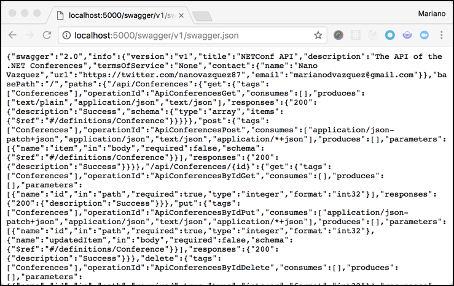

1. But to see more interesting things, navigate to `http://localhost:5000/swagger`:

    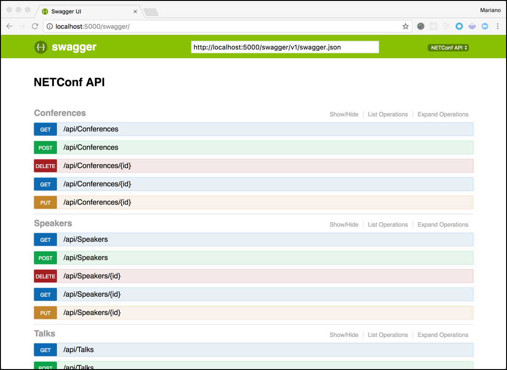

    Notice that every public action in our controllers is exposed in this UI. Moreover, you can try each one of them in this UI. Let's do this with the `api/conferences` endpoint: click the row to expand it and then click `Try it out!`. You should see now an example response with detailed information of the call.

    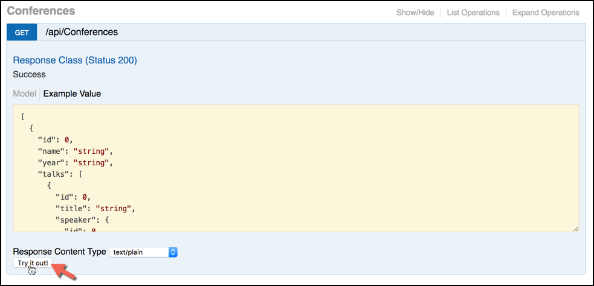

In the next section, we are going to update our code to improve what is displayed in the documentation.

#### Customizing the Swagger UI

There are severa things you can do to improve the documentation displayed for your UI. Let's try to cover the basics:

1. You can update the basic information, like a **description**, **terms of service** and **contact information**. For this, update the **services.AddSwaggerGen** section in the **ConfigureServices()** method (of the **Startup.cs** file). Make sure you replaced the placeholders with your own information.

    ```cs
    // Register the Swagger generator, defining one or more Swagger documents
    services.AddSwaggerGen(c =>
    {
        c.SwaggerDoc("v1", new Info
        {
            Version = "v1",
            Title = "NETConf API",
            Description = "The API of the .NET Conferences",
            TermsOfService = "None",
            Contact = new Contact { Name = "<YOUR-NAME>", Email = "<YOUR-EMAIL>", Url = "<YOUR-URL>" }
        });
    });
    ```

    Run the app again, you should see the following:

    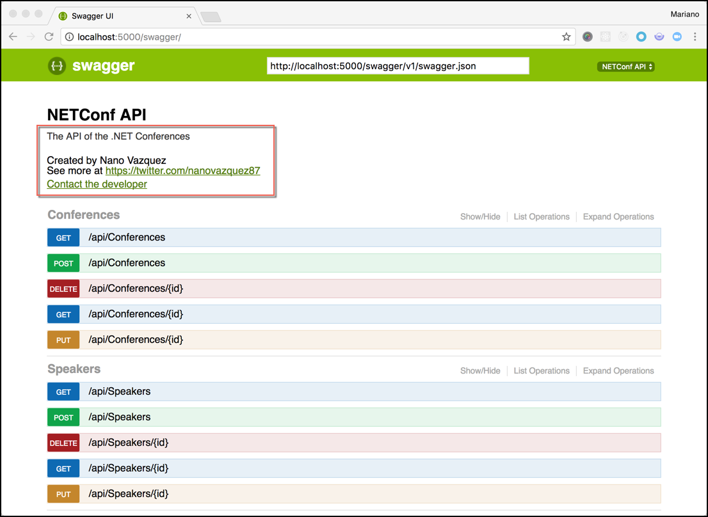

1. You can also add descriptions to each endpoint by using the XML comments in your classes. For this, you need:

    1. Right-click the project in the Solution Explorer and select **Properties**. Go to the **Build** tab and make sure the **XML documentation file** option under the **Output** section is checked.

        

    1. Add the following lines at the end of the `services.AddSwaggerGen` section. This will connect your app's comments with the Swagger generator.

        ```cs
        // Register the Swagger generator, defining one or more Swagger documents
        services.AddSwaggerGen(c =>
        {
            c.SwaggerDoc("v1", new Info
            {
                ...
            });

            // Set the comments path for the Swagger JSON and UI.
            var basePath = AppContext.BaseDirectory;
            var xmlPath = Path.Combine(basePath, "TodoApi.xml");
            c.IncludeXmlComments(xmlPath);
        });
        ```
    1. Now it's time to create the comments in our controllers. You know the drill: add _triple slash comments_ above every class and method you have. For simplicity, let's do this only for the **ConferencesController** class. Paste the following comments above this class methods:

        ```cs
        namespace NETConfAPI.Controllers
        {
            [Route("api/[controller]")]
            public class ConferencesController : Controller
            {
                ...

                /// <summary>
                /// Get Conferences
                /// </summary>
                [HttpGet]
                public IEnumerable<Conference> Get()
                {
                    ...
                }

                /// <summary>
                /// Get a Conference
                /// </summary>
                /// <param name="id">The ID of the conference</param>
                [HttpGet("{id}", Name = "GetConferencesById")]
                public IActionResult GetById(int id)
                {
                    ...
                }

                /// <summary>
                /// Create new Conference
                /// </summary>
                /// <param name="item"></param>
                /// <returns>A newly-created Conference</returns>
                /// <response code="201">Returns the newly-created item</response>
                /// <response code="400">If the item is null</response>
                [HttpPost]
                public IActionResult Post([FromBody]Conference item)
                {
                    ...
                }

                /// <summary>
                /// Update Conference
                /// </summary>
                /// <param name="id">The Conference ID</param>
                /// <param name="updatedItem"></param>
                [HttpPut("{id}")]
                public IActionResult Put(int id, [FromBody]Conference updatedItem)
                {
                    ...
                }

                /// <summary>
                /// Delete Conference
                /// </summary>
                /// <param name="id">The Conference ID</param>
                [HttpDelete("{id}")]
                public IActionResult Delete(int id)
                {
                    ...
                }
            }
        }
        ```

        This produces the following output:

        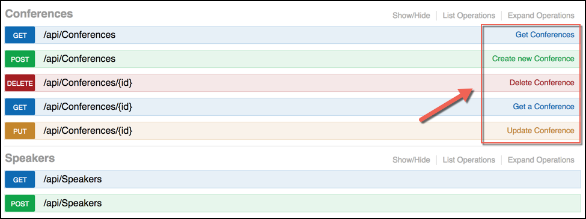

        And, more importantly, we now have better information about the status codes of each endpoint:

        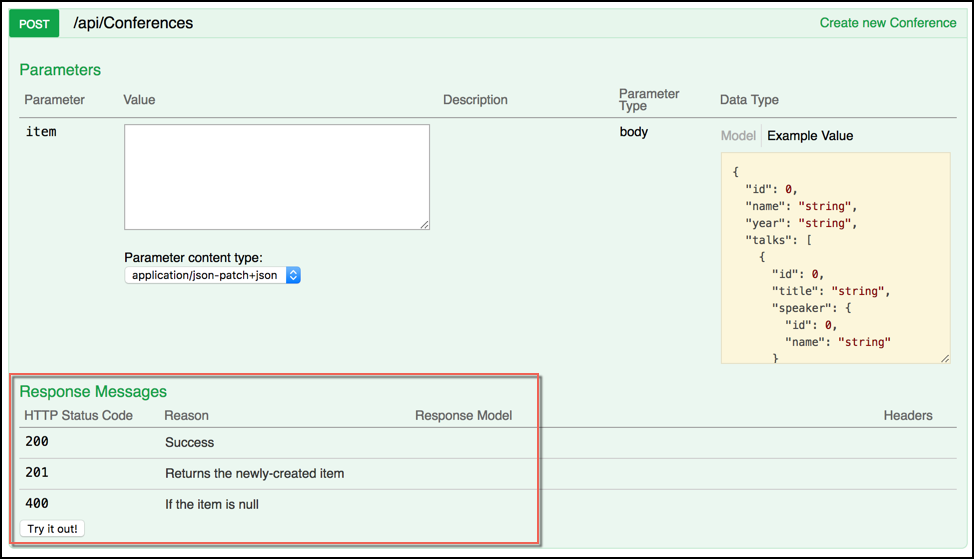

1. You can also use **Data Annotations** to describe your entities and other information about your API.

    * Add the `[Required]` field above the **Name** and **Year** property of the **Conference** class. Remember that you will need to add the following `using System.ComponentModel.DataAnnotations;` statement above the file.

        ```cs
        using System.Collections.Generic;
        using System.ComponentModel.DataAnnotations;

        namespace NETConfAPI.Models
        {
            public class Conference
            {
                public int Id { get; set; }

                [Required]
                public string Name { get; set; }

                [Required]
                public string Year { get; set; }

                public virtual ICollection<Talk> Talks { get; set; }
            }
        }
        ```

    Repeat the same for the **Title** property of the **Talk** class and the **Name** property of the **Speaker** class.

    * Now, add the following line in the **ConferencesController** class to tell Swagger specification that the endpoints managed by the controller will return `application/json`, instead of `text/plain`.

        ```cs
        [Produces("application/json")]
        [Route("api/[controller]")]
        public class ConferencesController : Controller
        ```

        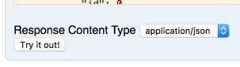

And that's it! There are a lot of other things you can do to improve the documentation. For a full list of features, see the [Swashbuckle documentation in GitHub](https://github.com/domaindrivendev/Swashbuckle)

### Deploy your API to Azure

Now that you have everything set up, you need to deploy your application to the cloud to be used in the next Exercise. For this, follow these steps:

1. In Visual Studio, right-click on the project in Solution Explorer and select **Publish**.

1. In the **Publish dialog**, select **Microsoft Azure App Service** and click **Publish**.

1. Configure your new application, use a free tier, and then click **Publish**. Once the process is complete, a new browser window or tab will be opened with the url of your service. To validate that everything works, navigate to `http://<YOUR-NAME>.azurewebsites.net/swagger`.

    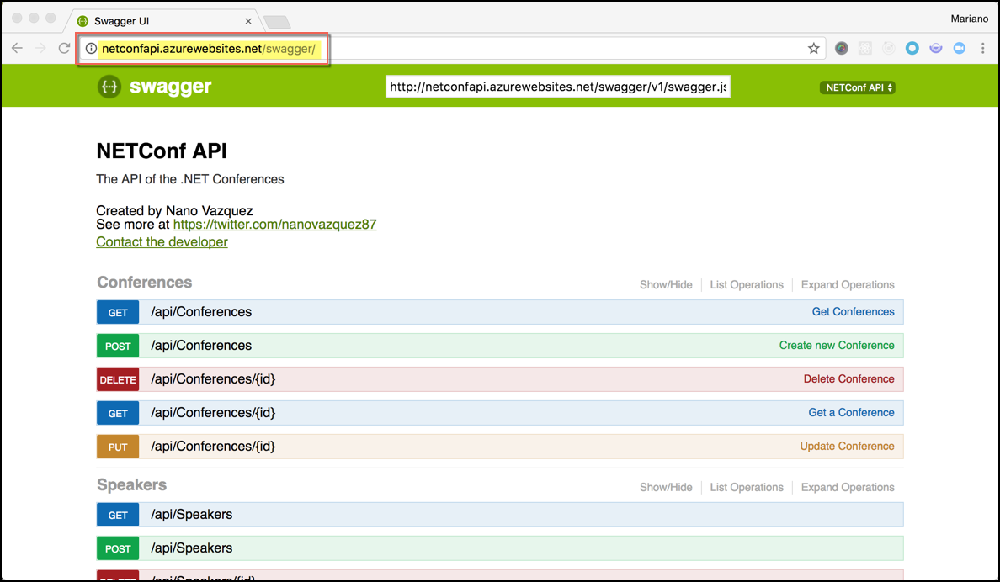

And that's it! Now you are ready to configure an API Gateway in Azure API Management.

