## Configure your Azure API Management Service

Azure API Management is a service that will help you to generate API Gateways for your existing backend-services hosted anywhere in a secure and controlled way. Using a self-service Publisher & Deverloper portal, you will be able to give access to other developers to an auto-generated API catalog with documentation and code samples. Your APIs will be secured and your clients will be able to connect to them using several mechanisms. Plus, you will be able to configure the behavior of your APIs with policies and you'll get a better understanding of how your APIs are being used and performing by reading real-time real-time analytics reports and log request.

During this exercise, you will learn how to configure your API with Azure API Management. Then, you will test the capabilities of your APIs like you were a client that wants to use your API. Finally,

> **Note:** If you want to deep dive into Azure API Management and its capabilities, see [here](https://docs.microsoft.com/en-us/azure/api-management/api-management-key-concepts).

### Exercise sections

To follow this exercise, you need to create an API Manager service instance in your Azure Portal. If you haven't done that yet, you can follow [this instructions](https://docs.microsoft.com/en-us/azure/api-management/get-started-create-service-instance).

* [Create your first API Gateway](#create-your-first-api-gateway)
* [Use the Developer Portal](#use-the-developer-portal)
* [View analytics reports of your API](#view-analytics-reports-of-your-api)

### Create your first API Gateway

You can use Azure API Management to take any backend and launch a full-fledged **API Gateway** based on it. This API Gateways will sit between your client and your backend and will, among other things:

* Accept API calls and routes them to your backends.
* Verify API keys, JWT tokens, certificates, and other credentials.
* Enforce usage quotas and rate limits.
* Transform your API on the fly without code modifications.
* Cache backend responses where set up.
* Log call metadata for analytics purposes.

In this section, you will create an **API Gateway** for the API you implemented in the _Exercise 1_. If you have skipped this exercise, you can use the API specification located in the **assets** folder of this exercise.

#### Creating an API Gateway

You will now use the **Publisher Portal**, an administrative interface where you can, among other things:

* Define or import API schema.
* Package APIs into Products.
* Set up policies like quotas or transformations on the APIs.
* Get insights from analytics.
* Manage users.
* Configure your Developer portal.

In this case, you will start by creating an **API Gateway** instance and then you will configure it to be used by clients.

1. Open the [Azure Portal](https://portal.azure.com/) and click your newly created API Manager service instance. You can find it either pinned in your Dashboard or in the **All resources** section.

    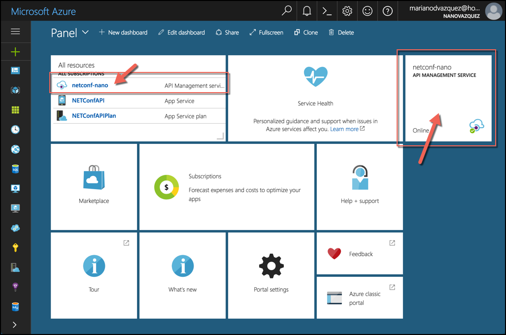

1. In the service toolbar at the top, there are two important links: **Publisher Portal** and **Developer Portal**. You will use the first one to configure your API Gateways and developers will use the second one to learn about them. For now, click the first link, we'll go to the Developer Portal later.

    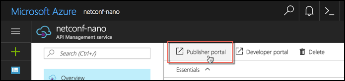

1. A new window or tab in your browser will be opened with the **Publisher Portal**.

    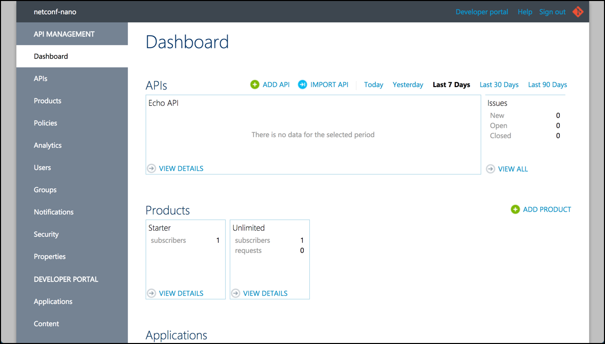

1. It's time to create our first API Gateway. For this, we will use the **Import API** option in the top menu.

    

1. In the **Import API** window, perform the following steps and then click **Save**:

    * There are 3 ways to import your **API Specification**: *from clipboard*, *from file* and *from url*. You can use any of these three options:
        * If you want to use **From clipboard**, copy the contents of the **netconf-swagger.json** file under the **assets** folder.
        * If you want to use **From file**, same as before, you can use the **netconf-swagger.json** file.
        * If you want to use **From URL**, use http://netconfapi.azurewebsites.net/swagger/v1/swagger.json
    * In **Specification format**, choose **Swagger**.
    * Make sure the **New API** option is choosed.
    * Use **netconf** as your **Web API URL suffix**.
    * Make sure **HTTPs** is checked as **Web API URL suffix**.
    * In the **Products (optional)** box, choose **Starter**.

    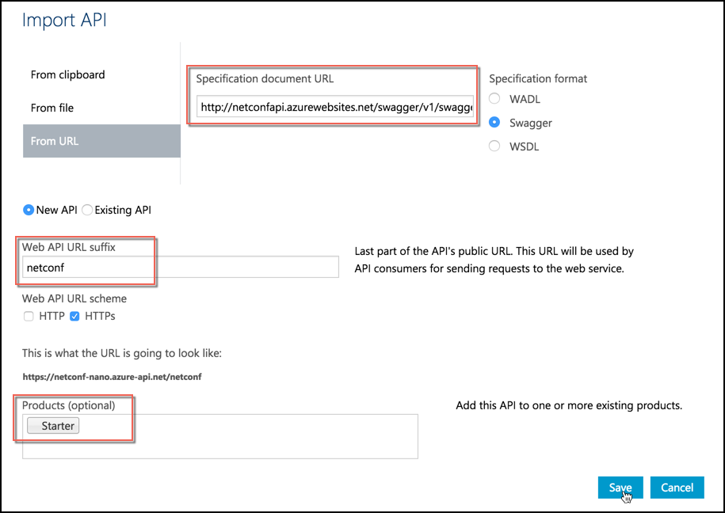

    Once the API is imported, the summary page for the API is displayed in the Publisher portal.

    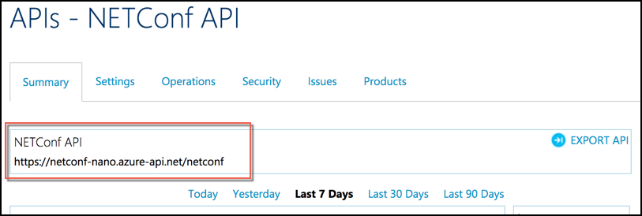

The API section has several tabs:

* The **Summary** tab displays basic metrics and information about the API.
* The **Settings** tab is used to view and edit the configuration for an API.
* The **Operations** tab is used to manage the API's operations.
* The **Security** tab can be used to configure gateway authentication for the backend server.
* The **Issues** tab is used to view issues reported by the developers who are using your APIs.
* The **Products** tab is used to configure the products that contain this API.

By default, each API Management instance comes with two sample products: **Starter** and **Unlimited**. We will talk about them in the next exercise. For now, let's go to the Developer Portal and configure it.

> **Note:** For more information about API sections, see [here](https://docs.microsoft.com/en-us/azure/api-management/api-management-howto-create-apis).

### Use the Developer Portal

The **Developer Portal** serves as the main entry point for developers. In this website, they can, among other things:

* Read API documentation.
* Try out an API via the interactive console.
* Create an account and subscribe to get API keys.
* Access analytics on their own usage.

In order to make calls to an API, developers must first subscribe to a product that gives them access to it. Developers can subscribe to products in the **Developer Portal**. You are an administrator since you created the API Management instance, so you are already subscribed to every product _by default_.

1. Access the Developer portal by clicking the **Developer Portal** option from the top menu of the Publisher Portal.

    

1. Log in into the portal with the same account you have for your Azure subscription. This way, you will be logged in as **Administrator**.

1. From the top menu, click **APIs** and then **NETConf API**.

    

    Note that everything we configured during Exercise 1, the descriptions, examples and parameters were imported along with the API and operations, providing documentation for the developers that will use this API. These descriptions can also be configured manually.

    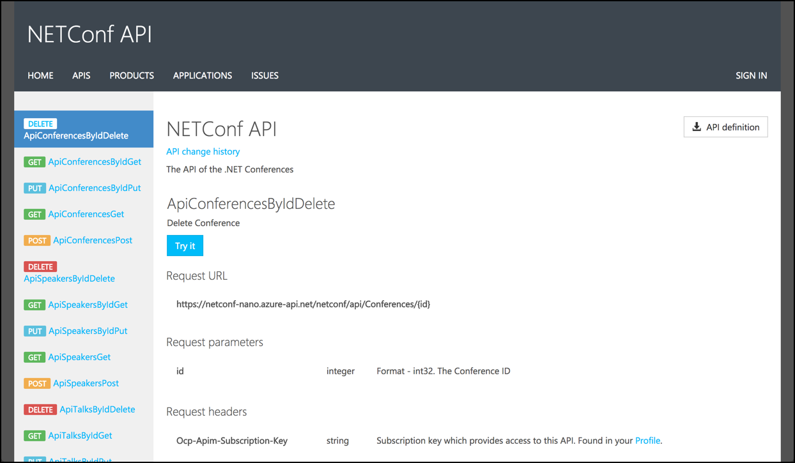

1. Select the second endpoint `GET Conferences by ID` and click **Try it**.

    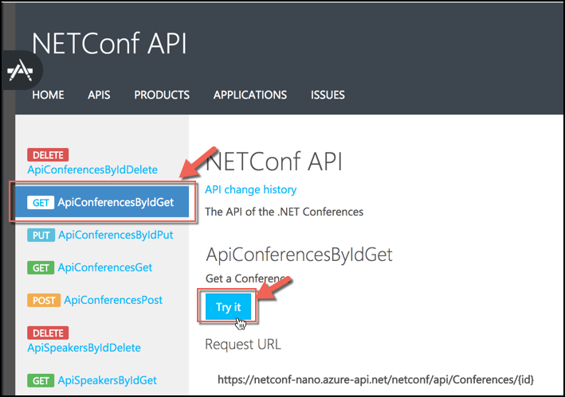

1. Enter the value `1` in the **id** field and click **Send**. You should see the following result in the **Response Content** section:

    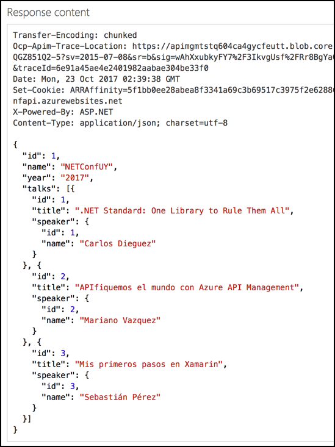

  Try other GET endpoints several times before moving on to the next step. We are going to need the traffic for the next section, Analytics.

1. Last, let's update the **Display name** of an endpoint with a better name. For this, go back to the **Publisher Portal**, click the **API** tab in the left pane and then select the API.

    Inside the **Operations** tab, click the **ApiConferencesByIdGet** and change its display name to **Get a Conference by Id**. Then, click **Save**.

    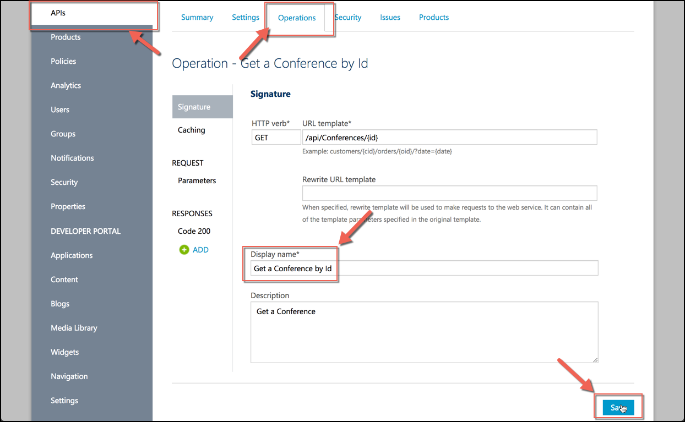

### View Analytics reports of your API

Now that we have used our API a little bit, we can review some of its traffic.

1. To view analytics for our API, switch back to the **Publisher portal**.

1. In the **Dashboard** section, you can see overview of your API Management instance, its APIs and its metrics. Hover the mouse over the chart to see the specific metrics for the usage of the API for a given time period.

    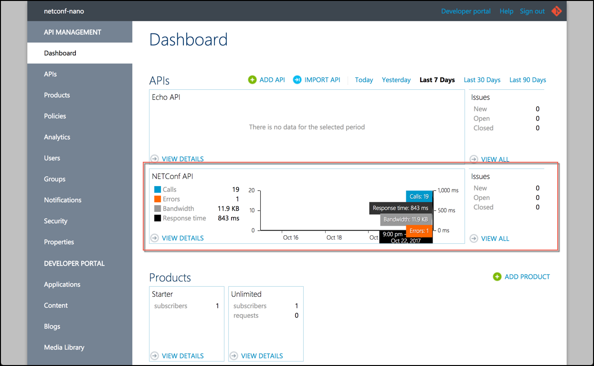

1. You can also visualize a summary of your API by clicking the **View Details** button or by clicking the **APIs** option of the left menu, and then your API.

    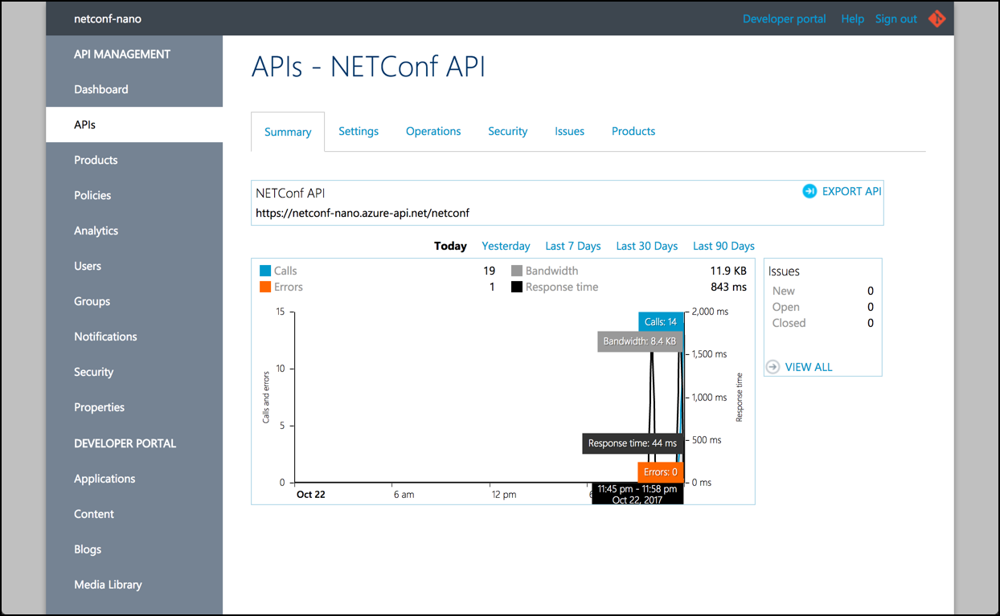

1. Finally, for detailed metrics and reports, click **Analytics** from menu of the left. This will give you information about your API Gateway:

    * **At a glance** provides overall usage and health metrics, as well as the top developers, top products, top APIs, and top operations.
    * **Usage** provides an in-depth look at API calls and bandwidth, including a geographical representation.
    * **Health** focuses on status codes, cache success rates, response times, and API and service response times.
    * **Activity** provides reports that drill down on the specific activity by developer, product, API, and operation.

    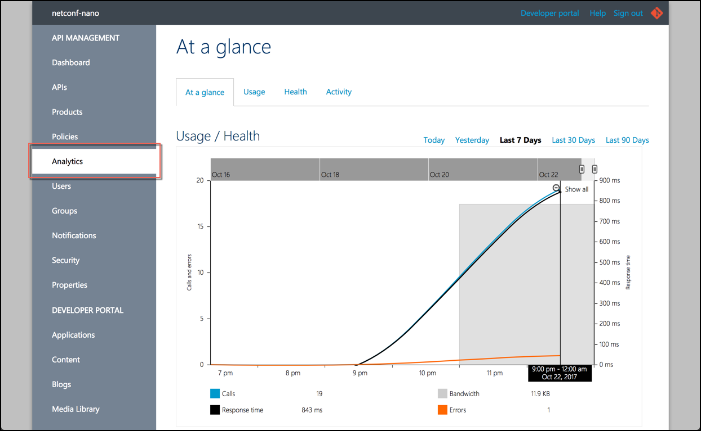

And we are just scratching the surface! For more information about analyticis, you can [watch the videos in the Azure Documentation site](https://docs.microsoft.com/en-us/azure/api-management/api-management-key-concepts#api-management-and-the-api-economy).

