## Configure your Azure API Gateway

In this exercise, you will learn how easy is to provide different subscriptions with independant capabilities to the clients of your API. In this tutorial, you will create a _Free trial** Product that, along with the other default Products, have different rate limit and quota policies for your API Gateway. Finally, you will learn how to configure caching in a specific operation of your API.

> **Note:** If you want to want to learn more about how you can configure your API Gateway, see [here](https://docs.microsoft.com/en-us/azure/api-management/api-management-howto-product-with-rules).

### Exercise sections

* [Configure Products for your API](#configure-products-for-your-api)
* [Configure Policies in your API](#configure-policies-in-your-api)
* [Configure caching in your API](#configure-caching-in-your-api)

### Configure Products for your API

**Products** is the way you can configure differents way to access your API. Products in API Management have one or more APIs, can be **Open** or **Protected**, requiring subscription approval before using the API (manual or automatic) and they support different and independent configurations.

In this section, you will create a **Free Trial** Product that allows developers subscribed to it to make up to 10 calls per minute and up to a maximum of 200 calls per week to your API. For this, we are going to use the **Limit call rate per subscription** and **Set usage quota per subscription** policies.

### Creating the Free Trial Product

1. To get started, click **Publisher portal** in the Azure Portal for your API Management service.

    

1. Click **Products** in the API Management menu on the left to display the Products page and then click **Add Product**.

    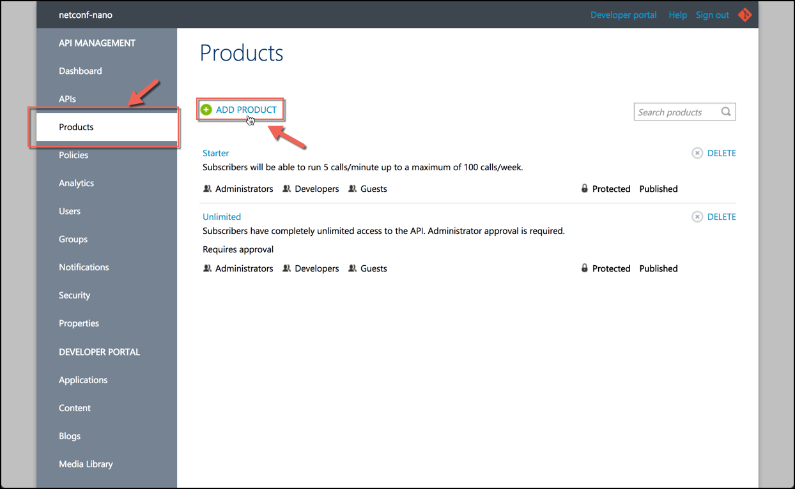

1. In the **Add new product** dialog, enter the following values and then click **Save**.

    * Title: `Free Trial`.
    * Description: `Subscribers will be able to run 10 calls/minute up to a maximum of 200 calls/week after which access is denied.`.
    * Make sure the **Require subscriptions** options is checked.

    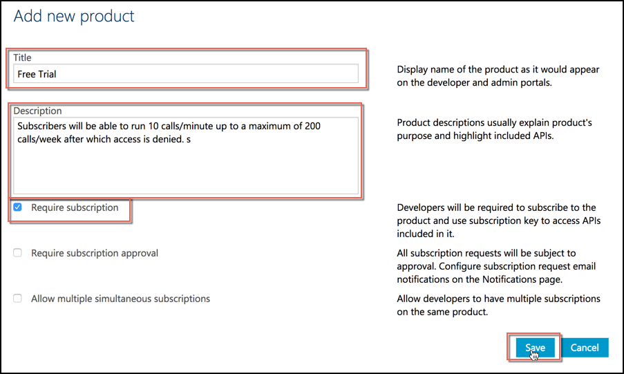

    > **Note:** Products in API Management can be **open** or **protected**. Open products can be used without a subscription, while Protected products must be subscribed to before they can be used.

#### Configuring visibility of the the Free Trial Product

By default, new products are visible only to users in the **Administrators** group. We are now going to add the **Developers** group, so they can use it.

1. In the **Products** section, click **Free Trial** Product and then click the **Visibility** tab.

1. Check the **Developers** check box and then click **Save**.

    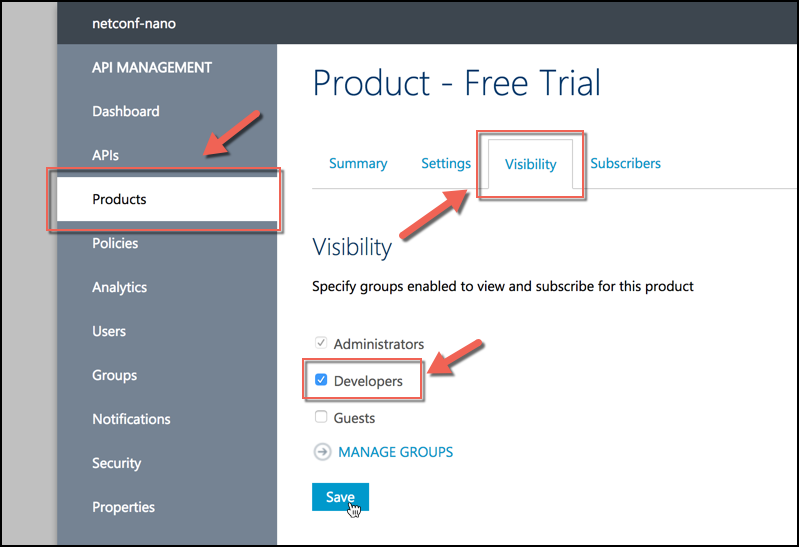

You should see a message at the top that confirms that the operation was successfull.

### Adding an API to the Free Trial Product

Now, we will add our NETConf API to the **Free Trial** product.

1. In the **Products** section, click **Free Trial** Product and then click **Add API to product**.

    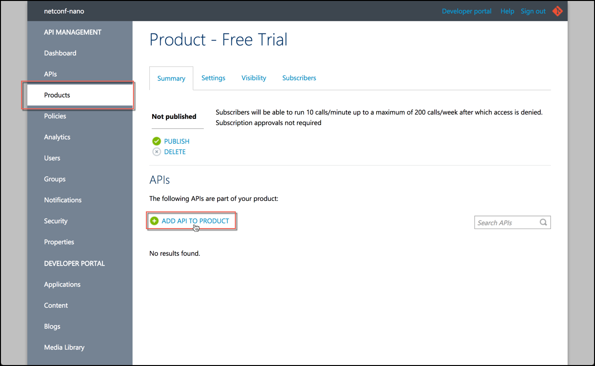

1. Check the **NETCOnf API** and then click **Save**.

    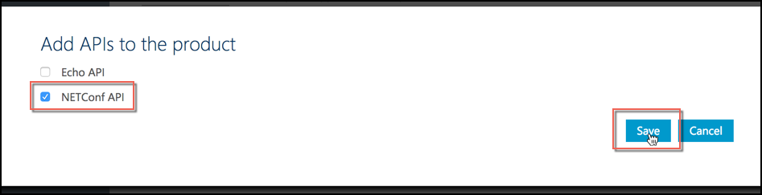

You should see now the API in the **Summary** tab of the **Free Trial** product.

### Configure Policies in your API

**Policies** allow you to change the behavior of the API through configuration, not code. Under the hood, they are a collection of statements that are executed sequentially on the _request_ or _response_ of an API, like format conversion (from XML to JSON), rate limiting, quotas or cache.

In this section, we will configure the **Limit call rate per subscription** and **Set usage quota per subscription** policies to the **Free Trial** product.

#### Configuring Policies in a Product

1. In the API Management menu on the left, click **Policies**.

1. In the **Products** list, select **Free Trial** and then **Add Policy**.

    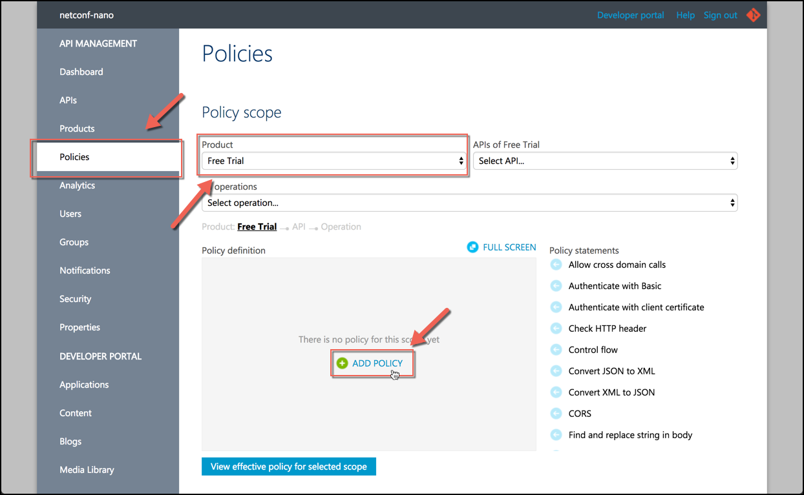

1. Since the two policies we are going to add are **inbound policies**, position the cursor in the **inbound** element.

    

1. Scroll through the list of policies and click the **Limit call rate per subscription policy** entry to insert a snippet.

1. Configure this policy snippet to only allow **10 calls per minute**. It should look like this:

    ```xml
    <rate-limit calls="10" renewal-period="60"></rate-limit>
    ```

    > **Note:** As you can see from the snippet, you can also set limits for the product's APIs and operations.

1. Repeat the process to configure the **Set usage quota per subscription** policy: position your cursor immediately below the newly added `<rate-limit>` element within the **inbound** element, and then click the entry to insert a snippet.

1. Configure this policy snippet to only allow **200 calls per week**. It should look like this:

    ```xml
    <quota calls="200" renewal-period="604800"></quota>
    ```

    > **Note:** Similarly to the rate limit policy, you can set quotas for the product's APIs and operations.

1. Click **Save** to apply your changes.

  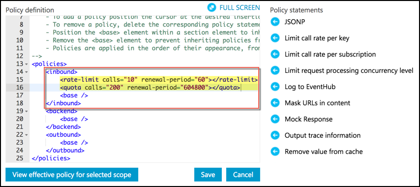

#### Publishing the Product

Now that the policies are configured, the API can be used by **Developers**. For this, we need to publish it.

1. Click **Products** from the API Management menu on the left and then click **Free Trial** Product.

1. Click **Publish** and then click **Yes, publish it** to confirm the operation. You should see now that the **Free Trial** product is marked as **Published**.

    

#### Trying the Product

Now that the product is published, it is available to be subscribed to and used by developers. As an **Administrators** of an API Management instance are automatically subscribed to every product, but you can subscribe one of the non-administrator developer accounts to the **Free Trial** product in the **Users** section.

1. Switch to the Developer Portal by clicking **Developer portal** option in the upper-right menu.

    

1. Click **APIs** in the top menu, and then click **NET Conf API**.

    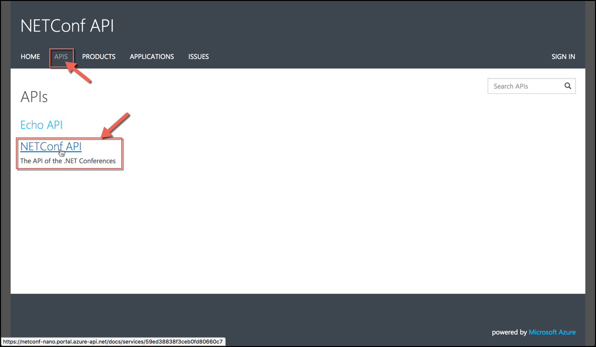

1. Click the **ApiConferencesGet** resource and then click **Try it**.

    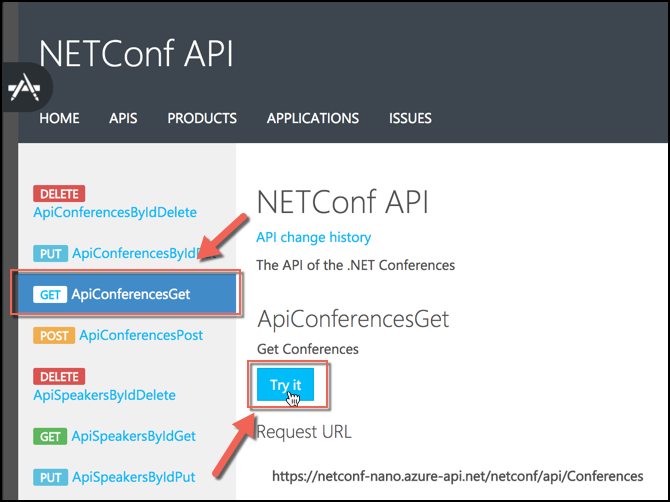

1. Select your subscription key for the **Free Trial** product and then click **Send**.

    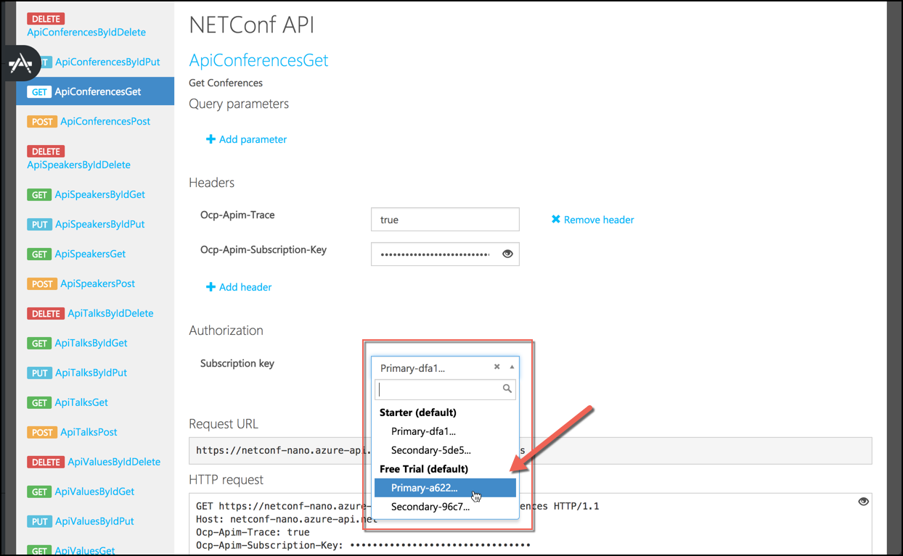

1. Click **Send** 11 times until the call fails. You should see the following error:

    

    **What is going on?**
    When the rate limit policy of 10 calls per minute is in effect, subsequent calls will fail with a **429 Too many requests** status message until 60 seconds have elapsed from the first of the 10 successful calls to the product before the rate limit was exceeded. The Response content indicates the remaining interval before retries will be successful in the **Retry-After** key.

### Configure caching in your API

Operations in API Management can be configured for response caching in order to reduce API latency, bandwidth consumption, and web service load for data that does not change frequently. This section shows you how to add response caching for your API by using policies.

> **Note:** For information on caching items by key using policy expressions, see [here](https://docs.microsoft.com/en-us/azure/api-management/api-management-sample-cache-by-key).

1. In the **Publisher Portal**, click **APIs** from the menu on the left and then click the **NETConf API**.

1. In the **NETConf API**, click the **Operations** tab and then the **ApiConferencesGet** endpoint.

    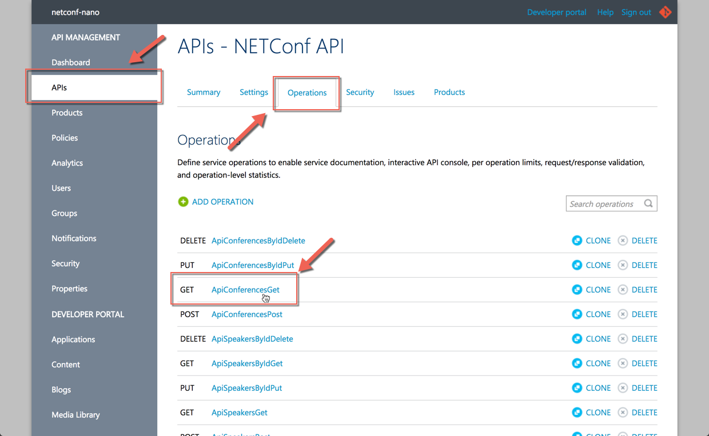

1. To enable caching in this endpoint, click the **Caching** tab, then **Enable** and finally click **Save**.

    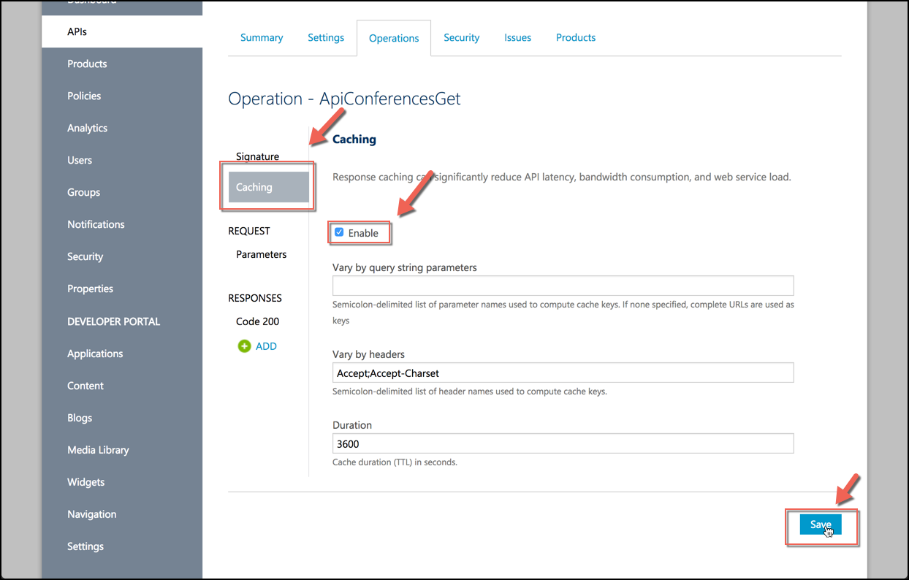

    Using this caching configuration , the first request will return a response from the backend service, but subsequent calls to the operation will return a cached instance until the cache is expired. This is the simplest configuration, but you can configure caching in different ways:

    * Each operation response is keyed based on the values in the **Vary by query string parameters** and **Vary by headers fields**. If you want to cache multiple responses based on query string parameters or headers, you can configure them in these two fields.
    * **Duration** specifies the expiration interval of the cached responses. In this case, we use 3600 seconds (1 hour).

1. Notice that the **Policy** section will be also affected by this change, and a policy specific to this API and endpoint will be present.

    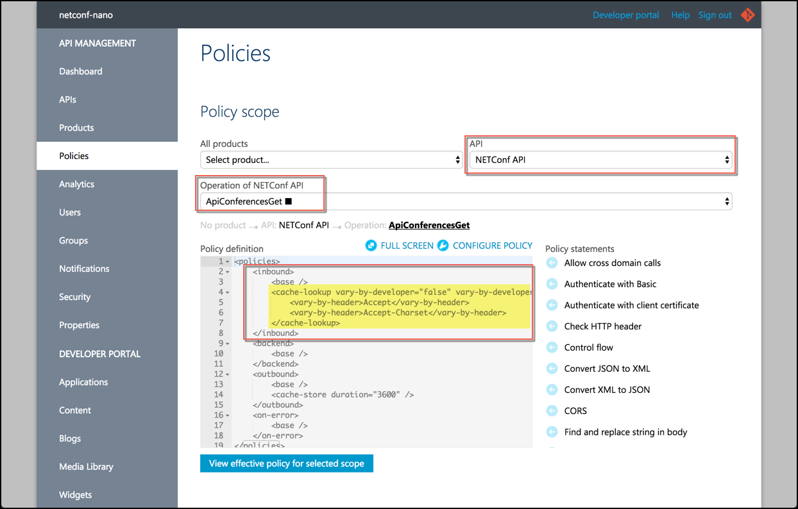

    > **Note:** Changes made to the caching policies in the policy editor will be reflected on the Caching tab of an operation, and vice-versa.

1. To see the caching in action, we can call the operation from the **Developer Portal**. Notice that the second time you make the call the **Response time** will be greatly reduced.

    #### First time
    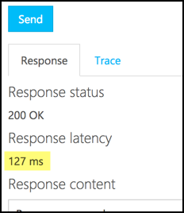

    #### Second time
    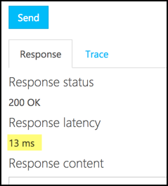